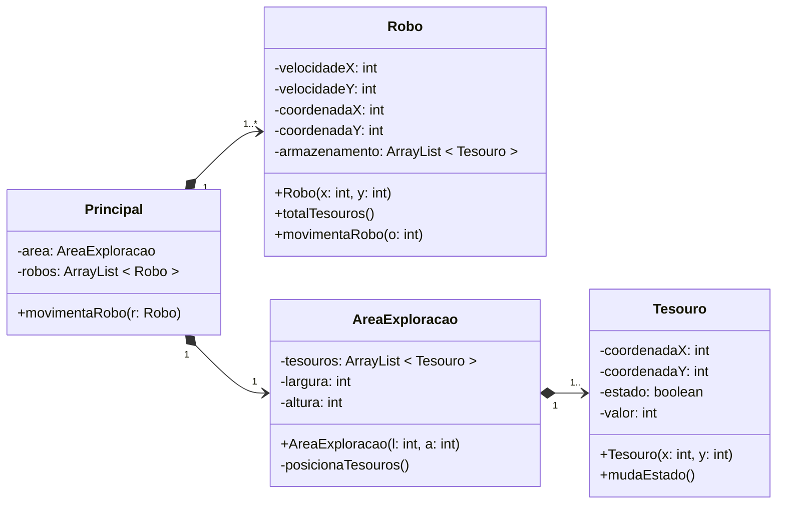

# Diagrama 

```mermaid
classDiagram
    direction LR

    class Robo {
        -velocidadeX: int
        -velocidadeY: int
        -coordenadaX: int
        -coordenadaY: int
        -armazenamento: ArrayList < Tesouro >
        +Robo(x: int, y: int)
        +totalTesouros()
        +movimentaRobo(o: int)
    }

    class Tesouro {
        -coordenadaX: int
        -coordenadaY: int
        -estado: boolean
        -valor: int
        +Tesouro(x: int, y: int)
        +mudaEstado()
    }

    class AreaExploracao {
        -tesouros: ArrayList < Tesouro >
        -largura: int
        -altura: int
        +AreaExploracao(l: int, a: int)
        -posicionaTesouros()
        

    }

    class Principal {
        -area: AreaExploracao
        -robos: ArrayList < Robo >
        +movimentaRobo(r: Robo)

    }

    AreaExploracao "1" *--> "1.." Tesouro
    Principal "1" *--> "1..*" Robo
    Principal "1" *--> "1" AreaExploracao

``` 