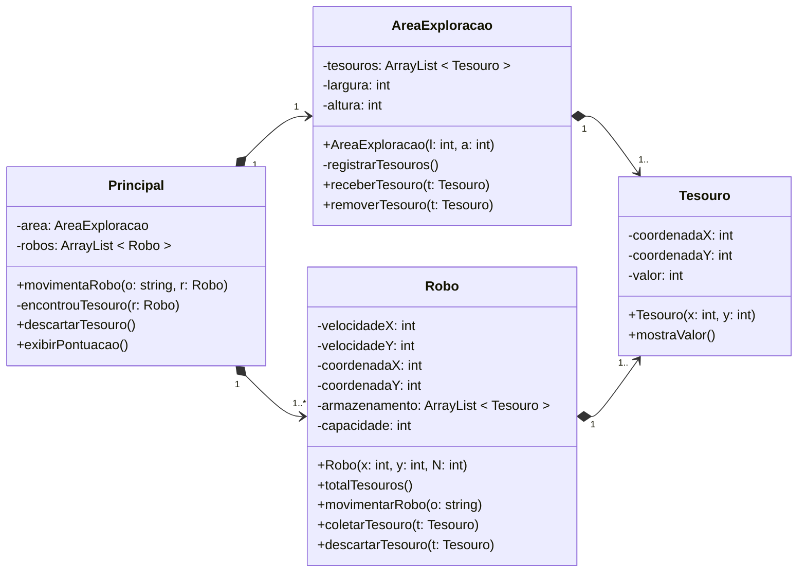

## Anotações 📝
- E se chegar em um número máximo de tesouros?
- Algum robô vai ganhar? O com mais tesouros ou com tesouros mais valiosos.
- A dimensão inicial de um robô deve ser proporcional à área de exploração e aos tesouros.
- Robô tem um identificador
- Ao descartar um tesouro para pegar outro mais valioso, o robô pode descartar o tesouro na área de exploração

// dependencia nunca tem um atributo d tipo massa (m: mapa)

## Diagrama 🤖
