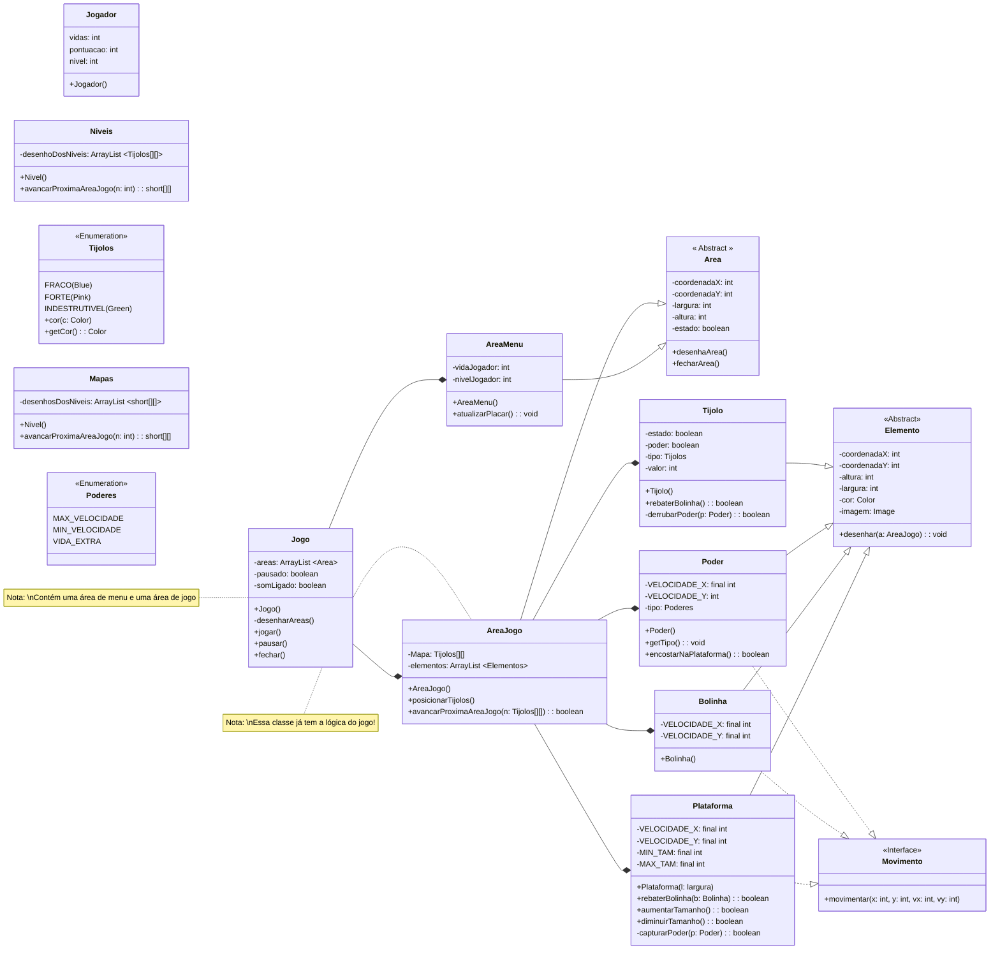

```mermaid
classDiagram
    direction LR

    class Jogador {
        vidas: int
        pontuacao: int
        nivel: int
        +Jogador()
    }

    note for Jogo "Nota: \nContém uma área de menu e uma área de jogo"
    class Jogo {
        -areas: ArrayList ~Area~
        -pausado: boolean
        -somLigado: boolean
        +Jogo()
        -desenharAreas()
        +jogar()
        +pausar()
        +fechar()

    }

    class Area {
        << Abstract >>
        -coordenadaX: int
        -coordenadaY: int
        -largura: int
        -altura: int
        -estado: boolean
        +desenhaArea()
        +fecharArea()
    }

    class AreaMenu {
        -vidaJogador: int
        -nivelJogador: int
        +AreaMenu()
        +atualizarPlacar(): void
    }

    note for AreaJogo "Nota: \nEssa classe já tem a lógica do jogo!"
   class AreaJogo {
        -Mapa: Tijolos[][]
        -elementos: ArrayList ~Elementos~
        +AreaJogo()
        +posicionarTijolos()
        +avancarProximaAreaJogo(n: Tijolos[][]): boolean
    }

    class Niveis {
        -desenhoDosNiveis: ArrayList ~Tijolos[][]~
        +Nivel()
        +avancarProximaAreaJogo(n: int): short[][]

    }

    class Tijolos {
        <<Enumeration>>
        FRACO(Blue)
        FORTE(Pink)
        INDESTRUTIVEL(Green)
        +cor(c: Color)
        +getCor(): Color
    }


    class Plataforma{
        -VELOCIDADE_X: final int
        -VELOCIDADE_Y: final int
        -MIN_TAM: final int
        -MAX_TAM: final int
        +Plataforma(l: largura)
        +rebaterBolinha(b: Bolinha): boolean
        +aumentarTamanho(): boolean
        +diminuirTamanho(): boolean
        -capturarPoder(p: Poder): boolean
    } 
    
    class Bolinha {
        -VELOCIDADE_X: final int
        -VELOCIDADE_Y: final int
        +Bolinha()
    } 

    class Tijolo {
        -estado: boolean
        -poder: boolean
        -tipo: Tijolos
        -valor: int
        +Tijolo()
        +rebaterBolinha(): boolean
        -derrubarPoder(p: Poder): boolean
    }

    class Poder {
        -VELOCIDADE_X: final int
        -VELOCIDADE_Y: int
        -tipo: Poderes
        +Poder()
        +getTipo(): void
        +encostarNaPlataforma(): boolean
    }

    class Elemento {
        <<Abstract>>
        -coordenadaX: int
        -coordenadaY: int
        -altura: int
        -largura: int
        -cor: Color
        -imagem: Image
        +desenhar(a: AreaJogo): void
    }

    class Movimento {
        <<Interface>>
        +movimentar(x: int, y: int, vx: int, vy: int)
    }

    class Mapas {
        -desenhosDosNiveis: ArrayList ~short[][]~
        +Nivel()
        +avancarProximaAreaJogo(n: int): short[][]

    }

    class Poderes {
        <<Enumeration>>
        MAX_VELOCIDADE
        MIN_VELOCIDADE
        VIDA_EXTRA
    }

    Tijolo --|> Elemento
    Poder --|> Elemento
    Bolinha --|> Elemento
    Plataforma --|> Elemento

    Poder ..|> Movimento 
    Bolinha ..|> Movimento 
    Plataforma ..|> Movimento
    AreaJogo --* Plataforma
    AreaJogo --* Bolinha
    AreaJogo --* Poder
    AreaJogo --* Tijolo

    Jogo --* AreaJogo
    Jogo --* AreaMenu

    AreaJogo --|> Area 
    AreaMenu --|> Area 
    
```