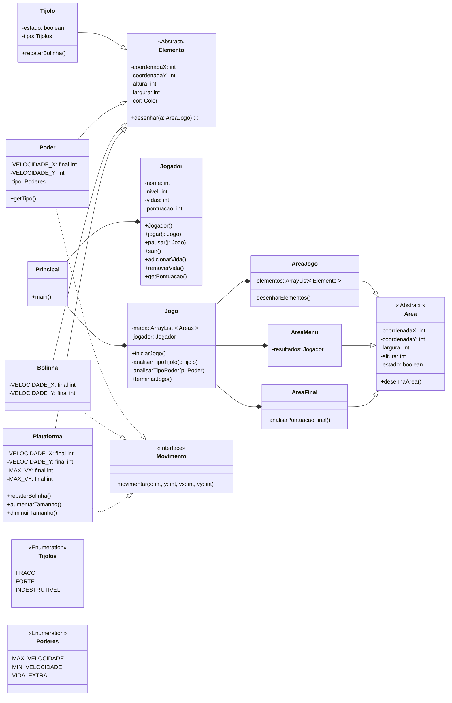

# Diagrama Projeto 02 🌸🦋

```mermaid
classDiagram
    direction LR


    class Principal {
        +main()
    }

    class Plataforma{
        -VELOCIDADE_X: final int
        -VELOCIDADE_Y: final int
        -MAX_VX: final int
        -MAX_VY: final int
        +rebaterBolinha()
        +aumentarTamanho()
        +diminuirTamanho()
    } 
    
    class Bolinha {
        -VELOCIDADE_X: final int
        -VELOCIDADE_Y: final int
    } 

    class Tijolo {
        -estado: boolean
        -tipo: Tijolos
        +rebaterBolinha()
    }

    class Poder {
        -VELOCIDADE_X: final int
        -VELOCIDADE_Y: int
        -tipo: Poderes
        +getTipo()
    }

    class Elemento {
        <<Abstract>>
        -coordenadaX: int
        -coordenadaY: int
        -altura: int
        -largura: int

        -cor: Color
    
        +desenhar(a: AreaJogo): 
    }

    class Area {
        << Abstract >>
        -coordenadaX: int
        -coordenadaY: int
        -largura: int
        -altura: int
        -estado: boolean
        +desenhaArea()
    }

    class AreaJogo {
        -elementos: ArrayList< Elemento >
        -desenharElementos()
    }

    class Jogador {
        -nome: int
        -nivel: int
        -vidas: int
        -pontuacao: int  
        +Jogador()
        +jogar(j: Jogo)
        +pausar(j: Jogo)
        +sair()
        +adicionarVida()
        +removerVida()
        +getPontuacao()

    }

    class AreaMenu {
        -resultados: Jogador
    }

    class AreaFinal {
        +analisaPontuacaoFinal()
    }

    class Jogo{
        -mapa: ArrayList < Areas >
        -jogador: Jogador
        +iniciarJogo()
        -analisarTipoTijolo(t:Tijolo)
        -analisarTipoPoder(p: Poder)
        +terminarJogo()
    }
    class Tijolos {
        <<Enumeration>>
        FRACO
        FORTE
        INDESTRUTIVEL
    }

    class Poderes {
        <<Enumeration>>
        MAX_VELOCIDADE
        MIN_VELOCIDADE
        VIDA_EXTRA
    }

    class Movimento {
        <<Interface>>
        +movimentar(x: int, y: int, vx: int, vy: int)
    }

    Tijolo --|> Elemento
    Poder --|> Elemento
    Bolinha --|> Elemento
    Plataforma --|> Elemento

    Poder ..|> Movimento 
    Bolinha ..|> Movimento 
    Plataforma ..|> Movimento

    AreaJogo --|> Area 
    AreaMenu --|> Area 
    AreaFinal --|> Area 

    Principal --* Jogo
    Principal --* Jogador

    Jogo --* AreaJogo
    Jogo --* AreaMenu
    Jogo --* AreaFinal


``` 
