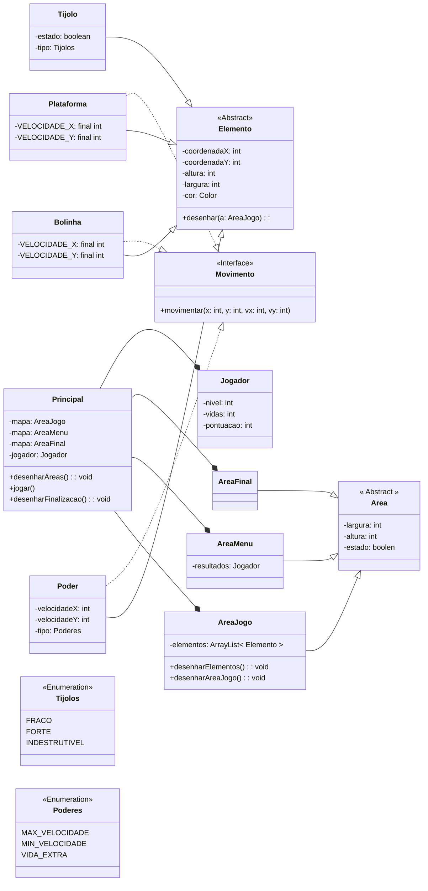

# Diagrama Projeto 02 🌸🦋

```mermaid
classDiagram
    direction LR

    class Principal {
        -mapa: AreaJogo
        -mapa: AreaMenu
        -mapa: AreaFinal
        -jogador: Jogador
        +desenharAreas(): void
        +jogar()
        +desenharFinalizacao(): void
    }

    class Plataforma{
        -VELOCIDADE_X: final int
        -VELOCIDADE_Y: final int
        
    } 
    
    class Bolinha {
        -VELOCIDADE_X: final int
        -VELOCIDADE_Y: final int
    } 

    class Tijolo {
        -estado: boolean
        -tipo: Tijolos
    }

    class Poder {
        -velocidadeX: int
        -velocidadeY: int
        -tipo: Poderes
    }

    class Elemento {
        <<Abstract>>
        -coordenadaX: int
        -coordenadaY: int
        -altura: int
        -largura: int

        -cor: Color
    
        +desenhar(a: AreaJogo): 
    }

    class Area {
        << Abstract >>
        -largura: int
        -altura: int
        -estado: boolen
    }

    class AreaJogo {
        -elementos: ArrayList< Elemento >
        +desenharElementos(): void
        +desenharAreaJogo(): void

    }

    class Jogador {
        -nivel: int
        -vidas: int
        -pontuacao: int  
    }

    class AreaMenu {
        -resultados: Jogador
    }

    class AreaFinal {
    }

    class Tijolos {
        <<Enumeration>>
        FRACO
        FORTE
        INDESTRUTIVEL
    }

    class Poderes {
        <<Enumeration>>
        MAX_VELOCIDADE
        MIN_VELOCIDADE
        VIDA_EXTRA
    }

    class Movimento {
        <<Interface>>
        +movimentar(x: int, y: int, vx: int, vy: int)
    }

    Tijolo --|> Elemento 
    Poder --|> Elemento 
    Bolinha --|> Elemento 
    Plataforma --|> Elemento

    Poder ..|> Movimento 
    Bolinha ..|> Movimento 
    Plataforma ..|> Movimento

    AreaJogo --|> Area 
    AreaMenu --|> Area 
    AreaFinal --|> Area 

    Principal --* AreaJogo
    Principal --* AreaMenu
    Principal --* AreaFinal
    Principal --* Jogador
    


``` 
