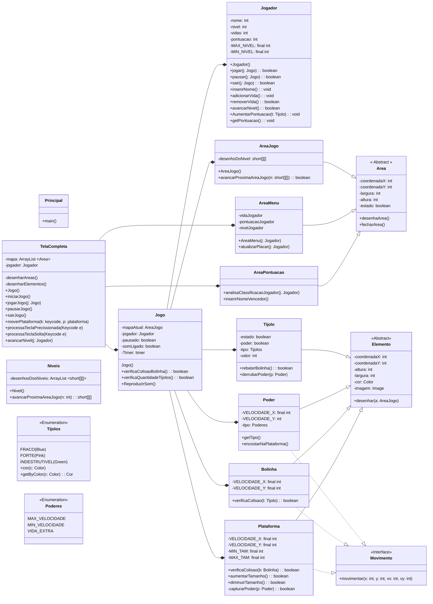

# Diagrama Projeto 02 🌸🦋

```mermaid
classDiagram
    direction LR

    class Principal {

        +main()
    }

    class TelaCompleta {
        -mapa: ArrayList ~Area~
        -jogador: Jogador
        -desenharAreas()
        -desenharElementos()
        +Jogo()
        +iniciarJogo()
        +jogarJogo(j: Jogo)
        +pausarJogo()
        +sairJogo()
        +moverPlataforma(k: keycode, p: plataforma)
        +processaTeclaPrecissionada(Keycode e)
        +processaTeclaSolta(Keycode e)
        +avancarNivel(j: Jogador)
    }

    class Jogo {
        -mapaAtual: AreaJogo
        -jogador: Jogador
        -pausado: boolean
        -somLigado: boolean
        -Timer: timer
        Jogo()
        +verificaColisaoBolinha(): boolean
        +verificaQuantidadeTijolos(): boolean
        +ReproduzirSom()
    }

    class Jogador {
        -nome: int
        -nivel: int
        -vidas: int
        -pontuacao: int  
        -MAX_NIVEL: final int
        -MIN_NIVEL: final int
        +Jogador()
        +jogar(j: Jogo): boolean
        +pausar(j: Jogo): boolean
        +sair(j: Jogo): boolean
        +inserirNome(): void
        +adicionarVida(): void
        +removerVida(): boolean
        +avancarNivel(): boolean
        +AumentarPontuacao(t: Tijolo): void
        +getPontuacao(): void
    }

    class Plataforma{
        -VELOCIDADE_X: final int
        -VELOCIDADE_Y: final int
        -MIN_TAM: final int
        -MAX_TAM: final int
        +verificaColisao(b: Bolinha): boolean
        +aumentarTamanho(): boolean
        +diminuirTamanho(): boolean
        -capturarPoder(p: Poder): boolean
    } 
    
    class Bolinha {
        -VELOCIDADE_X: final int
        -VELOCIDADE_Y: final int
        +verificaColisao(t: Tijolo): boolean
    } 

    class Tijolo {
        -estado: boolean
        -poder: boolean
        -tipo: Tijolos
        -valor: int
        +rebaterBolinha(): boolean
        +derrubarPoder(p: Poder)
    }

    class Poder {
        -VELOCIDADE_X: final int
        -VELOCIDADE_Y: int
        -tipo: Poderes
        +getTipo()
        +encostarNaPlataforma()
    }

    class Elemento {
        <<Abstract>>
        -coordenadaX: int
        -coordenadaY: int
        -altura: int
        -largura: int
        -cor: Color
        -imagem: Image
        +desenhar(a: AreaJogo)
    }

    class Area {
        << Abstract >>
        -coordenadaX: int
        -coordenadaY: int
        -largura: int
        -altura: int
        -estado: boolean
        +desenhaArea()
        +fecharArea()
    }

    class AreaMenu {
        -vidaJogador
        -pontuacaoJogador
        -nivelJogador
        +AreaMenu(j: Jogador)
        +atualizarPlacar(j: Jogador)
    }

    class AreaPontuacao {
        +analisaClassificacaoJogador(j: Jogador)
        +inserirNomeVencedor()
    }

    class AreaJogo {
        -desenhoDoNivel: short[][]
        +AreaJogo()
        +avancarProximaAreaJogo(n: short[][]): boolean
    }

    class Niveis {
        -desenhosDosNiveis: ArrayList ~short[][]~
        +Nivel()
        +avancarProximaAreaJogo(n: int): short[][]

    }

    class Tijolos {
        <<Enumeration>>
        FRACO(Blue)
        FORTE(Pink)
        INDESTRUTIVEL(Green)
        +cor(c: Color)
        +getByColor(c: Color): Cor
    }

    class Poderes {
        <<Enumeration>>
        MAX_VELOCIDADE
        MIN_VELOCIDADE
        VIDA_EXTRA
    }

    class Movimento {
        <<Interface>>
        +movimentar(x: int, y: int, vx: int, vy: int)
    }


    Tijolo --|> Elemento
    Poder --|> Elemento
    Bolinha --|> Elemento
    Plataforma --|> Elemento

    Poder ..|> Movimento 
    Bolinha ..|> Movimento 
    Plataforma ..|> Movimento

    AreaJogo --|> Area 
    AreaMenu --|> Area 
    AreaPontuacao --|> Area 

    TelaCompleta --* AreaMenu
    TelaCompleta --* AreaPontuacao
    TelaCompleta --* Jogo

    Jogo --* Jogador
    Jogo --* Plataforma
    Jogo --* Bolinha
    Jogo --* Poder
    Jogo --* Tijolo
    Jogo --* AreaJogo


``` 
