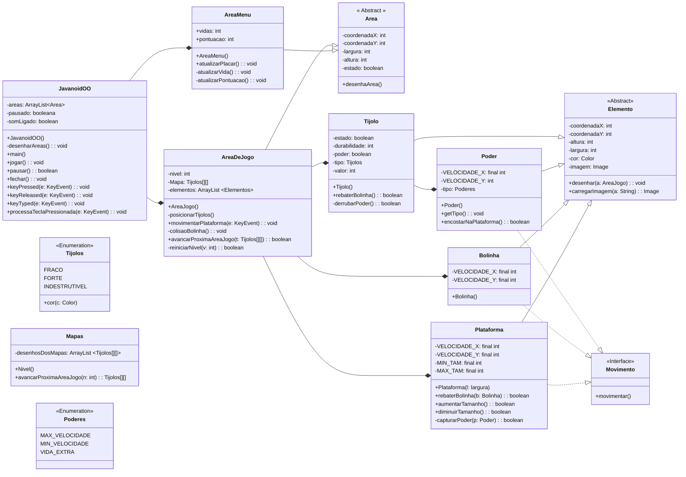

```mermaid
classDiagram
    direction LR


    class JavanoidOO {
        -areas: ArrayList~Area~
        -pausado: booleana
        -somLigado: boolean
        +JavanoidOO()
        -desenharAreas(): void
        +main()
        +jogar(): void
        +pausar(): boolean
        +fechar(): void
        +keyPressed(e: KeyEvent): void
        +keyReleased(e: KeyEvent): void
        +keyTyped(e: KeyEvent): void
        +processaTeclaPressionada(e: KeyEvent): void
    }

    class AreaDeJogo {
        -nivel: int

        -Mapa: Tijolos[][]
        -elementos: ArrayList ~Elementos~
        +AreaJogo()
        -posicionarTijolos()
        +movimentarPlataforma(e: KeyEvent): void
        -colisaoBolinha(): void

        +avancarProximaAreaJogo(t: Tijolos[][]): boolean
        -reiniciarNivel(v: int): boolean
    }

    class Area {
        << Abstract >>
        -coordenadaX: int
        -coordenadaY: int
        -largura: int
        -altura: int
        -estado: boolean
        +desenhaArea()
    }

    class AreaMenu {
        +vidas: int
        +pontuacao: int
        +AreaMenu()
        +atualizarPlacar(): void
        -atualizarVida(): void
        -atualizarPontuacao(): void
    }

    class Tijolos {
        <<Enumeration>>
        FRACO
        FORTE
        INDESTRUTIVEL
        +cor(c: Color)
    }

    class Plataforma{
        -VELOCIDADE_X: final int
        -VELOCIDADE_Y: final int
        -MIN_TAM: final int
        -MAX_TAM: final int
        +Plataforma(l: largura)
        +rebaterBolinha(b: Bolinha): boolean
        +aumentarTamanho(): boolean
        +diminuirTamanho(): boolean
        -capturarPoder(p: Poder): boolean
    } 
    
    class Bolinha {
        -VELOCIDADE_X: final int
        -VELOCIDADE_Y: final int
        +Bolinha()
    } 

    class Tijolo {
        -estado: boolean
        -durabilidade: int
        -poder: boolean
        -tipo: Tijolos
        -valor: int
        +Tijolo()
        +rebaterBolinha(): boolean
        -derrubarPoder(): boolean
    }

    class Poder {
        -VELOCIDADE_X: final int
        -VELOCIDADE_Y: int
        -tipo: Poderes
        +Poder()
        +getTipo(): void
        +encostarNaPlataforma(): boolean
    }

    class Elemento {
        <<Abstract>>
        -coordenadaX: int
        -coordenadaY: int
        -altura: int
        -largura: int
        -cor: Color
        -imagem: Image
        +desenhar(a: AreaJogo): void
        +carregarImagem(a: String): Image
    }

    class Movimento {
        <<Interface>>
        +movimentar()
    }

    class Mapas {
        -desenhosDosMapas: ArrayList ~Tijolos[][]~
        +Nivel()
        +avancarProximaAreaJogo(n: int): Tijolos[][]

    }

    class Poderes {
        <<Enumeration>>
        MAX_VELOCIDADE
        MIN_VELOCIDADE
        VIDA_EXTRA
    }

    Tijolo --|> Elemento
    Tijolo --* Poder
    Poder --|> Elemento
    Bolinha --|> Elemento
    Plataforma --|> Elemento

    Poder ..|> Movimento 
    Bolinha ..|> Movimento 
    Plataforma ..|> Movimento
    AreaDeJogo --* Plataforma
    AreaDeJogo --* Bolinha
    AreaDeJogo --* Tijolo

    JavanoidOO --* AreaDeJogo
    JavanoidOO --* AreaMenu

    AreaDeJogo --|> Area 
    AreaMenu --|> Area 

```
