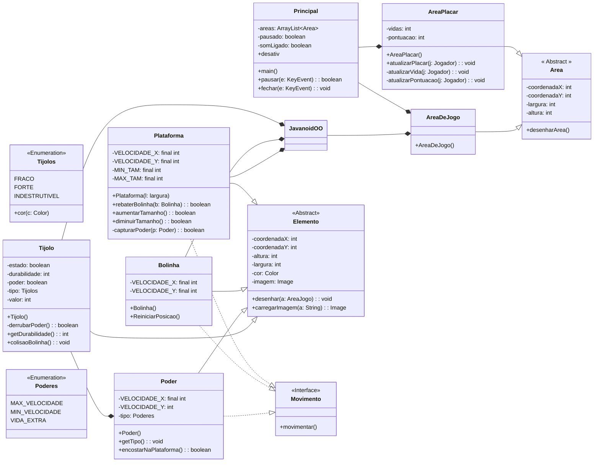

# Diagrama 

- Lógica do jogo;
- Onde receber as informações do teclado. (AreaJogo ou JavanoidOO).

```mermaid
classDiagram
    direction LR

    class Principal {
        -areas: ArrayList~Area~
        -pausado: boolean
        -somLigado: boolean
        +main()
        +pausar(e: KeyEvent): boolean
        +fechar(e: KeyEvent): void
        +desativ

    }

    class AreaDeJogo {
        +AreaDeJogo()

    }


    class JavanoidOO {
        
    }

    class Area {
        << Abstract >>
        -coordenadaX: int
        -coordenadaY: int
        -largura: int
        -altura: int
        +desenharArea()
    }

    class AreaPlacar {
        -vidas: int
        -pontuacao: int
        +AreaPlacar()
        +atualizarPlacar(j: Jogador): void
        -atualizarVida(j: Jogador): void
        -atualizarPontuacao(j: Jogador): void
    }

    class Tijolos {
        <<Enumeration>>
        FRACO
        FORTE
        INDESTRUTIVEL
        +cor(c: Color)
    }

    class Plataforma{
        -VELOCIDADE_X: final int
        -VELOCIDADE_Y: final int
        -MIN_TAM: final int
        -MAX_TAM: final int
        +Plataforma(l: largura)
        +rebaterBolinha(b: Bolinha): boolean
        +aumentarTamanho(): boolean
        +diminuirTamanho(): boolean
        -capturarPoder(p: Poder): boolean
    } 
    
    class Bolinha {
        -VELOCIDADE_X: final int
        -VELOCIDADE_Y: final int
        +Bolinha()
        +ReiniciarPosicao()
    } 

    class Tijolo {
        -estado: boolean
        -durabilidade: int
        -poder: boolean
        -tipo: Tijolos
        -valor: int
        +Tijolo()
        -derrubarPoder(): boolean
        +getDurabilidade(): int
        +colisaoBolinha(): void
    }

    class Poder {
        -VELOCIDADE_X: final int
        -VELOCIDADE_Y: int
        -tipo: Poderes
        +Poder()
        +getTipo(): void
        +encostarNaPlataforma(): boolean
    }

    class Elemento {
        <<Abstract>>
        -coordenadaX: int
        -coordenadaY: int
        -altura: int
        -largura: int
        -cor: Color
        -imagem: Image
        +desenhar(a: AreaJogo): void
        +carregarImagem(a: String): Image
    }

    class Movimento {
        <<Interface>>
        +movimentar()
    }

    class Poderes {
        <<Enumeration>>
        MAX_VELOCIDADE
        MIN_VELOCIDADE
        VIDA_EXTRA
    }

    Tijolo --|> Elemento
    Tijolo --* Poder
    Poder --|> Elemento
    Bolinha --|> Elemento
    Plataforma --|> Elemento

    Poder ..|> Movimento 
    Bolinha ..|> Movimento 
    Plataforma ..|> Movimento
    Plataforma --* JavanoidOO
    Bolinha --* JavanoidOO
    Tijolo --* JavanoidOO

    JavanoidOO --* AreaDeJogo

    AreaDeJogo --|> Area 
    AreaPlacar --|> Area 

    Principal --* AreaPlacar
    Principal --* AreaDeJogo
    

```