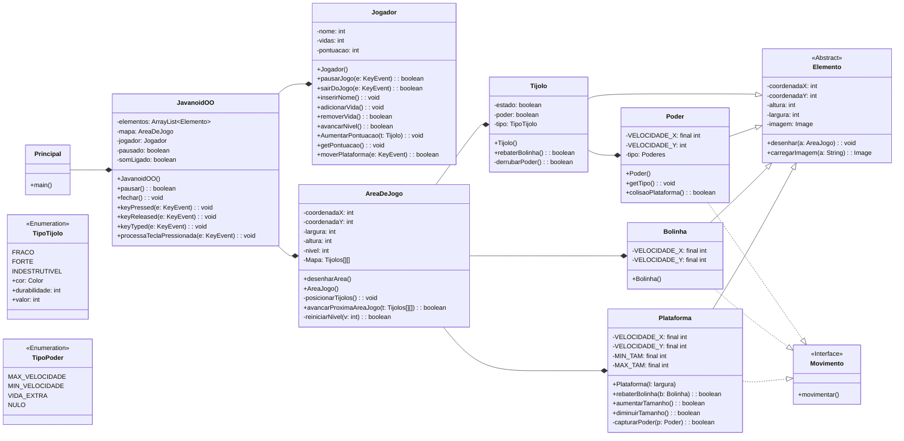

# Diagrama JavanoidOO 🎮🎯

```mermaid
classDiagram
    direction LR

    class Principal {
        +main()
    }

    class Jogador {
        -nome: int
        -vidas: int
        -pontuacao: int
        +Jogador()
        +pausarJogo(e: KeyEvent): boolean
        +sairDoJogo(e: KeyEvent): boolean
        +inserirNome(): void
        +adicionarVida(): void
        +removerVida(): boolean
        +avancarNivel(): boolean
        +AumentarPontuacao(t: Tijolo): void
        +getPontuacao(): void
        +moverPlataforma(e: KeyEvent): boolean
    }

    class JavanoidOO {
        -elementos: ArrayList~Elemento~
        -mapa: AreaDeJogo
        -jogador: Jogador
        -pausado: boolean
        -somLigado: boolean
        +JavanoidOO()
        +pausar(): boolean
        +fechar(): void
        +keyPressed(e: KeyEvent): void
        +keyReleased(e: KeyEvent): void
        +keyTyped(e: KeyEvent): void
        +processaTeclaPressionada(e: KeyEvent): void
    }

    class AreaDeJogo {
        -coordenadaX: int
        -coordenadaY: int
        -largura: int
        -altura: int
        +desenharArea()
        -nivel: int
        -Mapa: Tijolos[][]

        +AreaJogo()
        -posicionarTijolos(): void
        +avancarProximaAreaJogo(t: Tijolos[][]): boolean
        -reiniciarNivel(v: int): boolean
    }

    class Plataforma{
        -VELOCIDADE_X: final int
        -VELOCIDADE_Y: final int
        -MIN_TAM: final int
        -MAX_TAM: final int
        +Plataforma(l: largura)
        +rebaterBolinha(b: Bolinha): boolean
        +aumentarTamanho(): boolean
        +diminuirTamanho(): boolean
        -capturarPoder(p: Poder): boolean
    } 
    
    class Bolinha {
        -VELOCIDADE_X: final int
        -VELOCIDADE_Y: final int
        +Bolinha()
    } 

    class Tijolo {
        -estado: boolean
        -poder: boolean
        -tipo: TipoTijolo
        +Tijolo()
        +rebaterBolinha(): boolean
        -derrubarPoder(): boolean
    }

    class TipoTijolo {
        <<Enumeration>>
        FRACO
        FORTE
        INDESTRUTIVEL
        +cor: Color
        +durabilidade: int
        +valor: int
    }

    class Poder {
        -VELOCIDADE_X: final int
        -VELOCIDADE_Y: int
        -tipo: Poderes
        +Poder()
        +getTipo(): void
        +colisaoPlataforma(): boolean
    }

    class Elemento {
        <<Abstract>>
        -coordenadaX: int
        -coordenadaY: int
        -altura: int
        -largura: int
        -imagem: Image
        +desenhar(a: AreaJogo): void
        +carregarImagem(a: String): Image
    }

    class Movimento {
        <<Interface>>
        +movimentar()
    }

    class TipoPoder {
        <<Enumeration>>
        MAX_VELOCIDADE
        MIN_VELOCIDADE
        VIDA_EXTRA
        NULO
    }

    Tijolo --|> Elemento
    Tijolo --* Poder
    Poder --|> Elemento
    Bolinha --|> Elemento
    Plataforma --|> Elemento


    Poder ..|> Movimento 
    Bolinha ..|> Movimento 
    Plataforma ..|> Movimento
    AreaDeJogo --* Plataforma
    AreaDeJogo --* Bolinha
    AreaDeJogo --* Tijolo

    JavanoidOO --* AreaDeJogo
    JavanoidOO --* Jogador

    Principal --* JavanoidOO
    

```